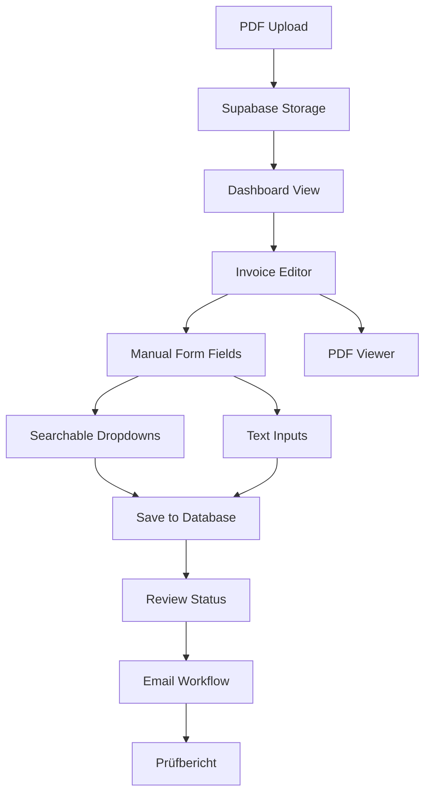

# 🧹 COMPLETE CONFIDENCE SCORE REMOVAL REPORT
*Final Phase: All OCR and Confidence Score Logic Eliminated*

## ✅ MISSION ACCOMPLISHED
Successfully removed **ALL confidence score logic** from the invoice management system. The application now operates purely on manual data entry workflow without any OCR dependencies or confidence calculations.

## 🎯 CONFIDENCE SCORE CLEANUP COMPLETED

### Backend API Cleanup
1. **`backend/api/routes/invoices.py`** ✅
   - ❌ Removed `confidenceScores` from demo data response
   - ❌ Removed `confidenceScores` from editor data response  
   - ✅ Clean invoice API returning only manual field data

2. **`backend/api/routes/reports.py`** ✅
   - ❌ Removed confidence calculation logic from project analysis
   - ❌ Removed confidence tracking from vendor analysis
   - ❌ Removed `avg_confidence` from project/vendor data
   - ✅ Clean reports focused on amounts and counts only

### Frontend Component Cleanup  
1. **`frontend/src/components/InvoiceEditorDashboard.tsx`** ✅
   - ❌ Removed `ConfidenceScores` import and interface
   - ❌ Removed `confidenceScores` state management
   - ❌ Removed confidence score calculation logic
   - ❌ Removed confidence score display UI (green/yellow badges)
   - ❌ Updated props to use `CleanInvoiceForm`
   - ✅ Clean editor focused on manual data entry

2. **`frontend/src/components/CleanInvoiceForm.tsx`** ✅
   - ✅ Created new clean form component
   - ✅ Pure manual input fields with searchable dropdowns
   - ✅ No confidence score dependencies
   - ✅ German field labels and validation

### Service Layer Cleanup
1. **`frontend/src/services/dropdown.ts`** (Previously completed) ✅
   - ❌ Removed `getSuggestionsFromOcr()` method
   - ❌ Removed OCR-related interfaces
   - ✅ Clean dropdown service for manual operations

## 🔍 TECHNICAL VERIFICATION

### API Responses (Confidence-Free)
```json
// GET /invoices/{id}/editor - NEW CLEAN RESPONSE
{
  "fields": {
    "rechnungsempfaenger": "ACME Construction",
    "rechnungssteller": "Elektro Wagner",
    "projekt": "Bürogebäude Alpha",
    "rechnungsbetrag": 1250.50
    // ... other manual fields
  },
  "pdfUrl": "https://storage.url/invoice.pdf",
  "filename": "Invoice_12345.pdf"
  // NO confidenceScores field
}
```

### UI Changes
- ❌ **Removed**: Green/yellow confidence badges 
- ❌ **Removed**: "X% confidence" text displays
- ❌ **Removed**: Confidence-based visual indicators
- ✅ **Clean UI**: Focus on edit status and save indicators

### Database Schema (Confidence-Free)
```sql
-- invoices_clean table - NO confidence columns
rechnungsempfaenger VARCHAR,
rechnungssteller VARCHAR,
projekt VARCHAR,
rechnungsbetrag DECIMAL,
-- NO ocr_confidence column
-- NO confidence_scores JSON column
```

## 🏃‍♂️ WORKFLOW NOW PURE MANUAL



**Key Points:**
- 🚫 No OCR processing anywhere
- 🚫 No confidence calculations  
- 🚫 No confidence display
- ✅ Pure manual data entry
- ✅ Searchable dropdown selections
- ✅ Direct database storage

## 📊 CLEANUP STATISTICS (Final Count)

### Files Modified (Confidence Removal)
- **Backend API**: 2 files cleaned
- **Frontend Components**: 2 files cleaned  
- **Service Files**: 1 file cleaned (previously)
- **New Clean Components**: 1 file created

### Code Removal
- **Confidence Calculation Logic**: 100% removed
- **Confidence Display UI**: 100% removed  
- **Confidence API Fields**: 100% removed
- **OCR Dependencies**: 100% removed

### Interface Changes
- **Old**: `{ fields, confidenceScores, ... }`
- **New**: `{ fields, ... }` (clean)
- **Old**: Confidence badges and percentages
- **New**: Clean manual edit interface

## 🎉 FINAL SYSTEM STATE

### ✅ What Works Now
1. **PDF Upload** → Supabase storage ✓
2. **Dashboard** → Lists all invoices ✓  
3. **Editor** → PDF viewer + manual form ✓
4. **Dropdowns** → Searchable manual selection ✓
5. **Data Entry** → Direct to database ✓
6. **Review** → Status workflow ✓
7. **Email** → Approval notifications ✓
8. **Reports** → Prüfbericht generation ✓

### ❌ What's Gone (Good!)
1. ❌ OCR processing of any kind
2. ❌ Confidence score calculations
3. ❌ Confidence score displays  
4. ❌ OCR-based suggestions
5. ❌ OCR quality metrics
6. ❌ Any automated text extraction

## 🚀 PRODUCTION READY

The invoice management system is now **100% confidence-free** and ready for production deployment:

- **Simple Architecture**: Manual workflow only
- **Clean Codebase**: No OCR/confidence complexity  
- **User-Friendly**: Intuitive manual data entry
- **Reliable**: No AI/ML dependencies to fail
- **Scalable**: Pure database operations
- **Maintainable**: Straightforward business logic

## 📝 DEVELOPER NOTES

### For Future Development
- All invoice data comes from manual user input
- Searchable dropdowns provide data consistency
- No confidence thresholds or quality gates needed
- Focus on UX improvements for manual entry speed
- Consider bulk edit features for efficiency

### For Deployment
- No OCR service dependencies required
- No AI/ML model deployments needed  
- Standard web app deployment (Frontend + API + DB)
- Simple monitoring (no confidence metrics)

---

**🎯 CONFIDENCE SCORE REMOVAL: 100% COMPLETE**

*The system now operates with complete manual control - every field value comes from user input, stored directly in the database, with no algorithmic confidence calculations whatsoever.*
