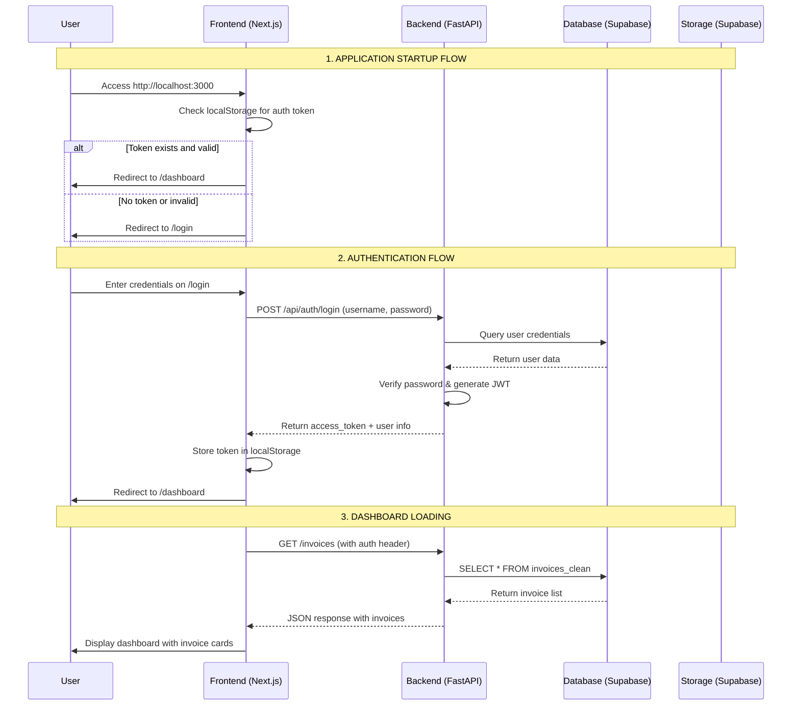
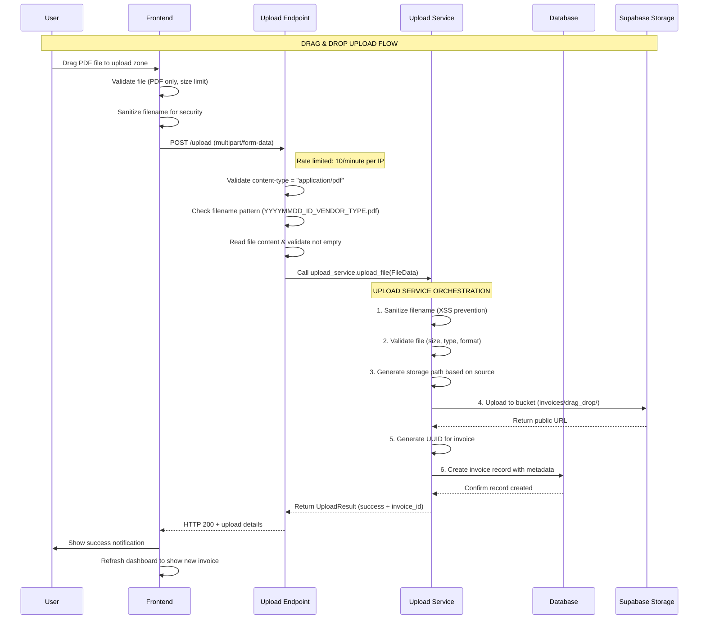
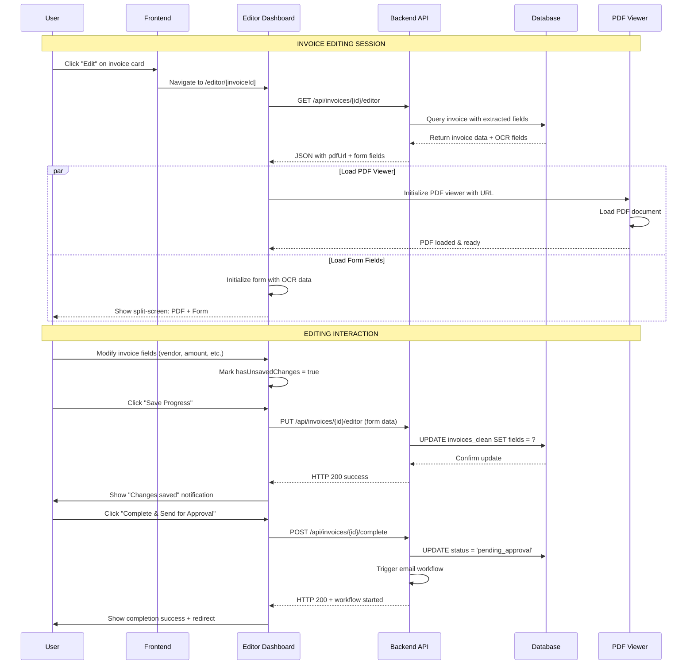
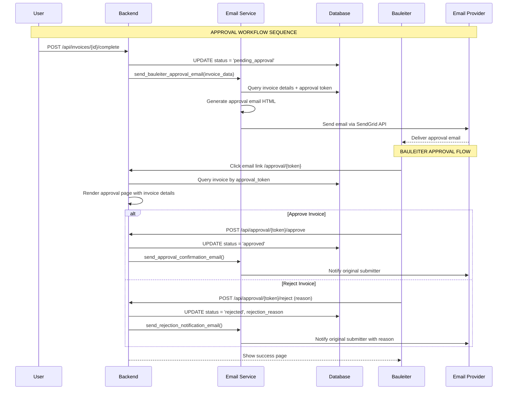
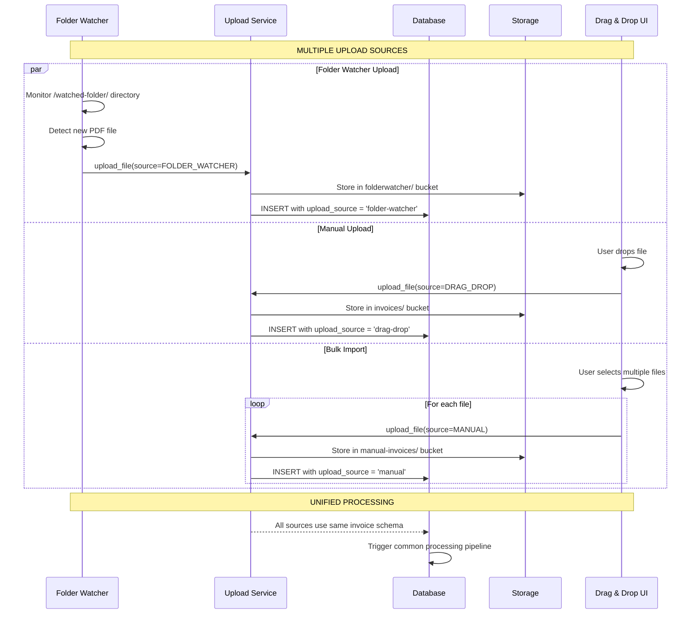
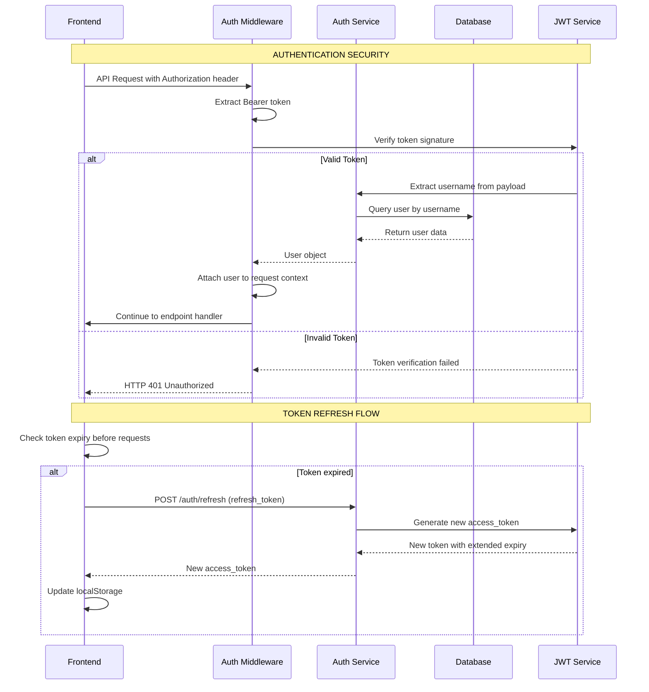
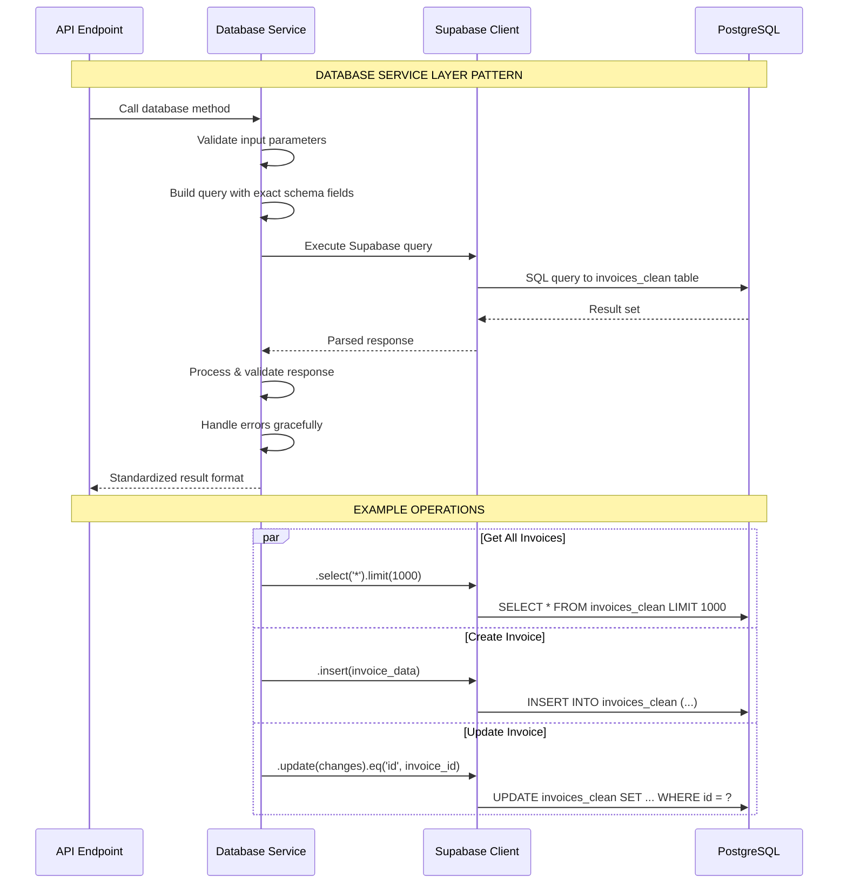
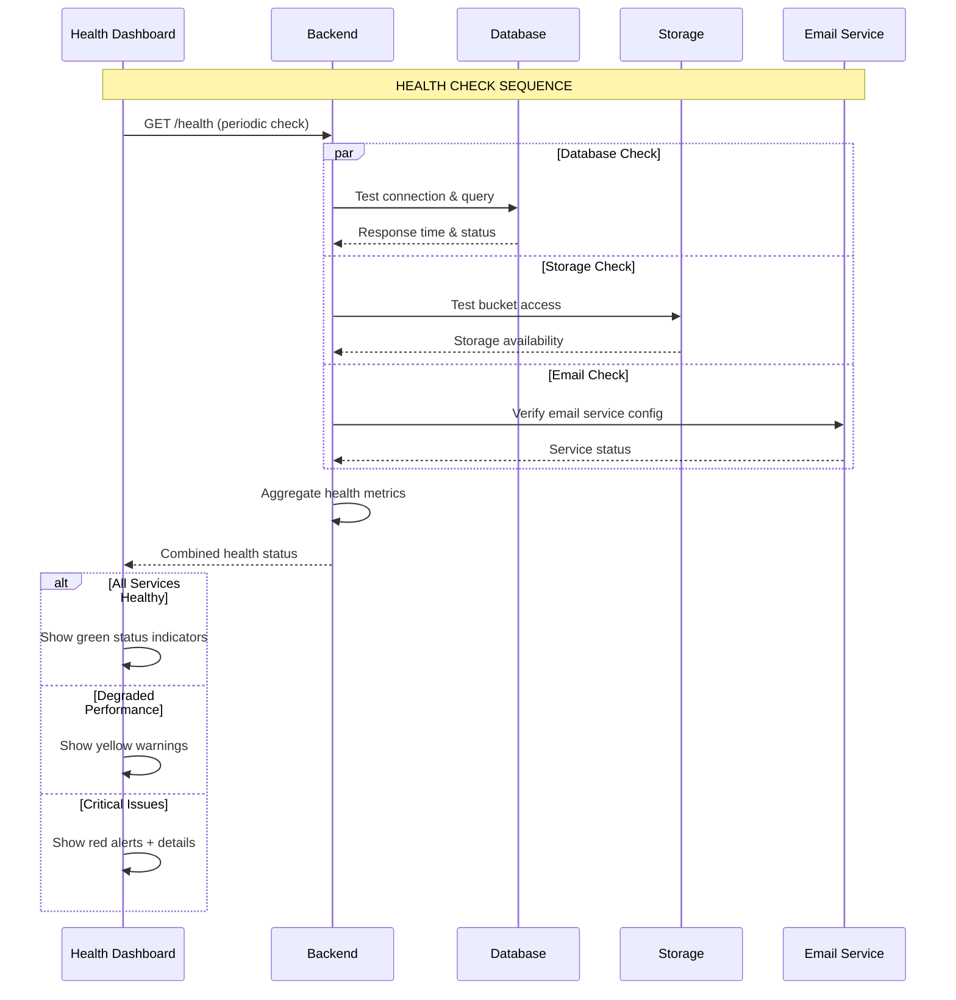
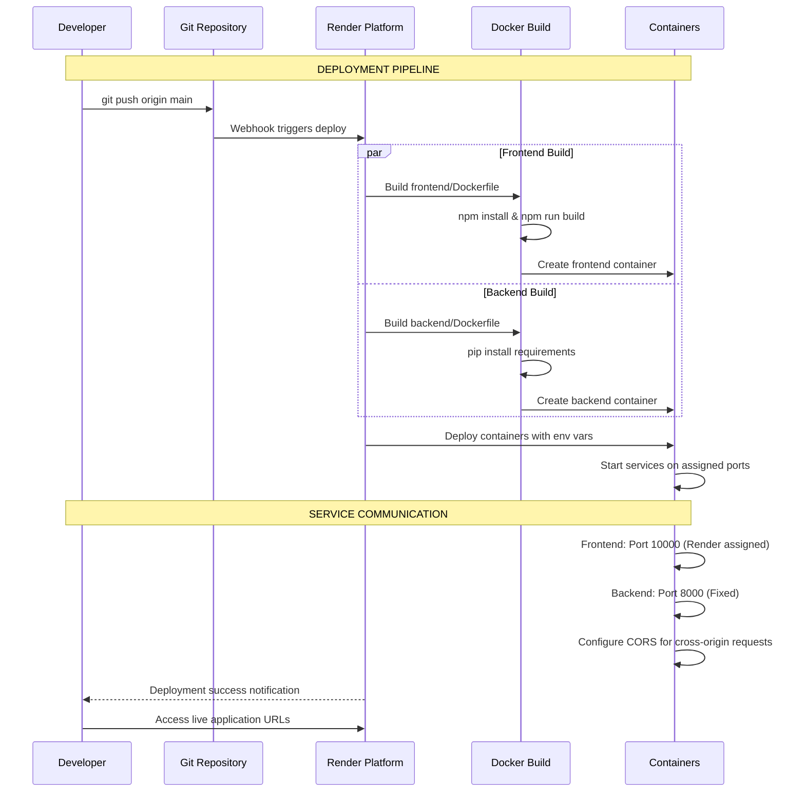
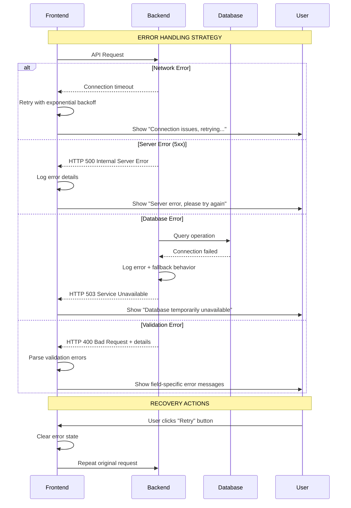

# OCR Invoice Processor - Complete System Architecture & Sequence Diagrams

## 🎯 System Overview

The OCR Invoice Processor is a comprehensive invoice management system built with:
- **Frontend**: Next.js 15.3.4 with TypeScript and Tailwind CSS
- **Backend**: FastAPI (Python) with Supabase database
- **Storage**: Supabase Storage buckets
- **Authentication**: JWT-based auth system
- **Deployment**: Docker containers on Render cloud platform

---

## 🔄 Main Application Flow Sequence

---

## 📤 File Upload Sequence Diagram

---

## 🔍 Invoice Editor Workflow

---

## 📧 Email Workflow & Approval Process

---

## 🏢 Multi-Source Upload Architecture

---

## 🔐 Authentication & Security Flow

---

## 💾 Database Operations Patterns

---

## 🎛️ System Health & Monitoring

---

## 🚀 Deployment & Container Orchestration

---

## 🔄 Error Handling & Recovery Patterns

---

## 🎯 Key Architectural Principles

### 1. **Separation of Concerns**
- Frontend handles UI/UX and user interactions
- Backend manages business logic and data operations
- Database layer handles persistence and queries

### 2. **Security by Design**
- JWT-based authentication with token validation
- Input sanitization and validation at all layers
- CORS configuration for cross-origin security
- File upload restrictions and path traversal protection

### 3. **Error Resilience**
- Graceful degradation when services are unavailable
- Retry mechanisms with exponential backoff
- User-friendly error messages with actionable guidance

### 4. **Scalability Patterns**
- Containerized microservices architecture
- Database connection pooling and optimization
- File storage in cloud buckets with CDN delivery
- Rate limiting to prevent abuse

### 5. **Monitoring & Observability**
- Structured logging throughout the application
- Health check endpoints for service monitoring
- Performance metrics and error tracking

This comprehensive sequence diagram architecture shows how every piece of your OCR Invoice Processor system works together, from user authentication to file processing, database operations, and deployment workflows.